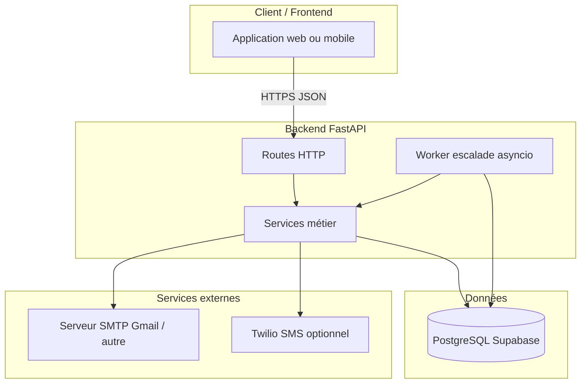
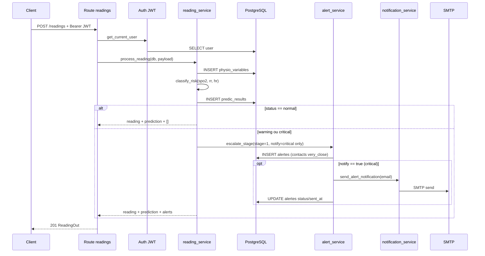
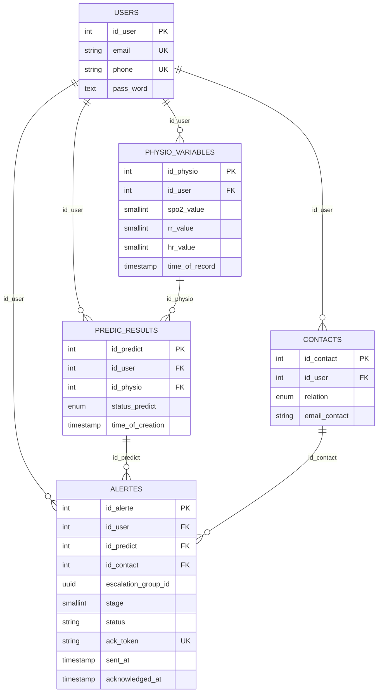
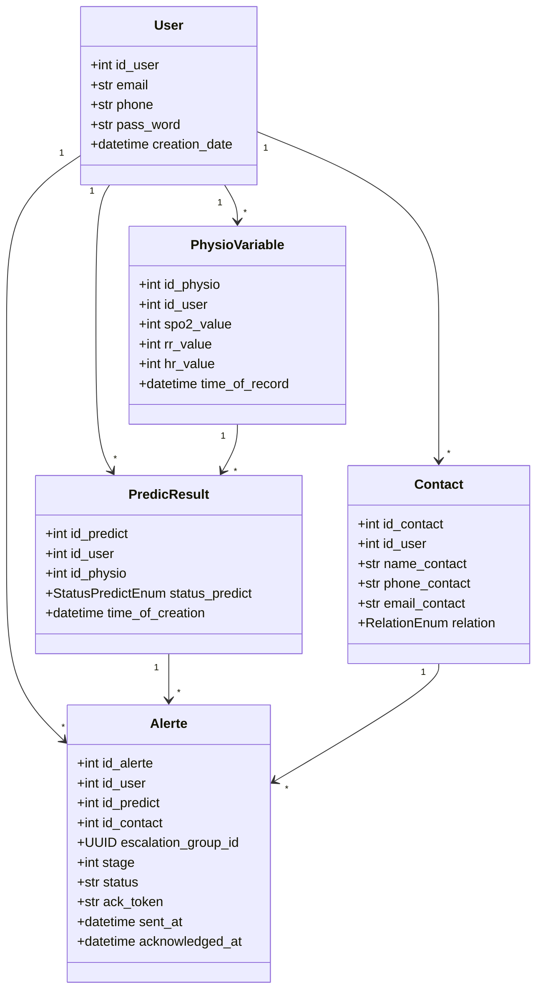
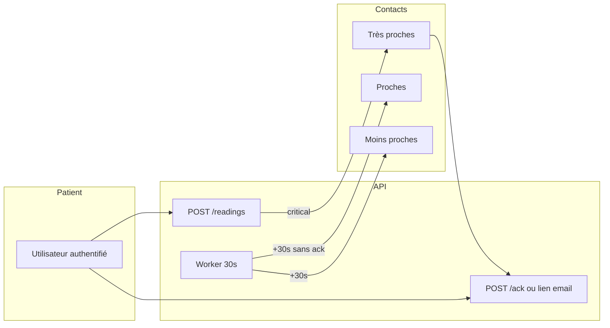
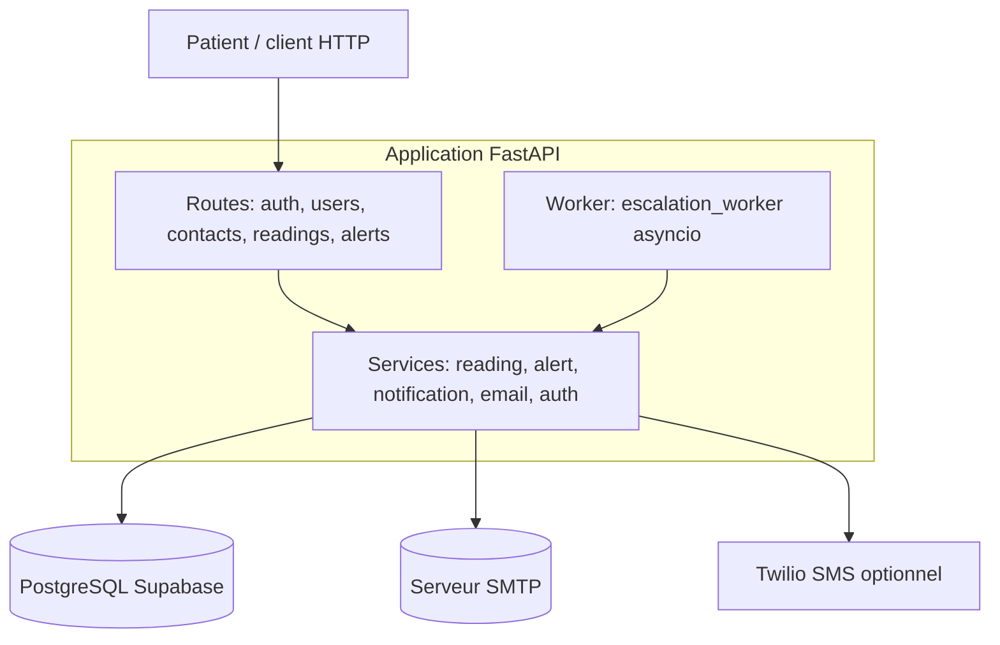
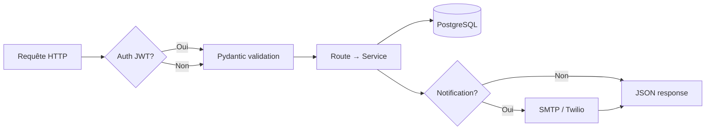
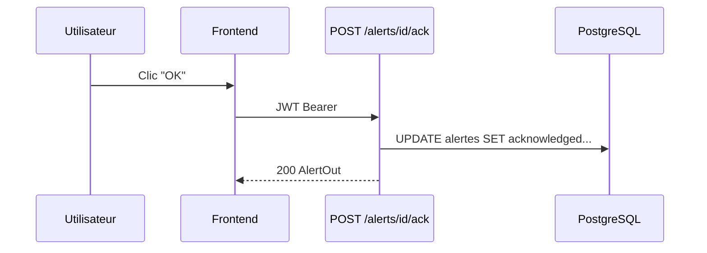

# Documentation technique — Backend Ashtme (surveillance asthme) 

> **Référence** : présentation orale, soutenance, README avancé, architecture technique.  
> **Stack** : FastAPI · SQLAlchemy · Pydantic · PostgreSQL (Supabase) · JWT · SMTP / Twilio (optionnel).  
> **État du dépôt** : monolithe Python 3.13+ ; worker d’escalade intégré au processus API.

---

## Table des matières

1. [Présentation générale du projet](#1-présentation-générale-du-projet)
2. [Architecture globale](#2-architecture-globale)
3. [Pipeline complet du système](#3-pipeline-complet-du-système)
4. [Technologies utilisées](#4-technologies-utilisées)
5. [Structure du projet](#5-structure-du-projet)
6. [Base de données](#6-base-de-données)
7. [APIs et endpoints](#7-apis-et-endpoints) — incl. schémas JSON et règles de classification
8. [Authentification et sécurité](#8-authentification-et-sécurité)
9. [Workflow métier](#9-workflow-métier)
10. [Diagrammes UML et architecture](#10-diagrammes-uml-et-architecture)
11. [Gestion des erreurs et logs](#11-gestion-des-erreurs-et-logs)
12. [Déploiement](#12-déploiement)
13. [Optimisations et scalabilité](#13-optimisations-et-scalabilité)
14. [Difficultés techniques rencontrées](#14-difficultés-techniques-rencontrées)
15. [Conclusion technique](#15-conclusion-technique)

---

## 1. Présentation générale du projet

### 1.1 Nom et périmètre

| Élément | Description |
|--------|-------------|
| **Nom** | Backend **Ashtme** (monitoring asthme) — package Python `backend` |
| **Objectif** | API REST pour enregistrer des **mesures physiologiques** (SpO₂, FC, FR), les **classifier**, stocker des **prédictions**, générer des **alertes** vers des **contacts d’urgence**, avec **escalade** et **notifications** (email prioritaire, SMS optionnel). |
| **Problématique** | Centraliser données patient + contacts + risque + traçabilité des notifications, de façon modulaire et extensible (future couche ML). |
| **Utilisateurs ciblés** | Patient (utilisateur authentifié), contacts d’urgence (notifiés), équipe produit / clinique (évolution future). |

### 1.2 Fonctionnalités principales

- **Authentification** : inscription, connexion (JWT), déconnexion (côté client), profil utilisateur.
- **Contacts** : CRUD liés à un utilisateur.
- **Lectures** : enregistrement mesures, historique, dernière mesure.
- **Prédictions** : statut `normal` / `warning` / `critical` (règles simples, pas de ML embarqué).
- **Alertes** : création par palier (`very close` → `close` → `not that close`), suivi `status`, email + lien d’accusé de réception contact, accusé utilisateur.
- **Automatisation** : boucle asyncio d’escalade automatique après **30 s** sans accusé (prédictions **critical** uniquement).

### 1.3 Contexte

Projet orienté **enseignement / prototype** : architecture claire (routes fines, services), hébergement DB typique **Supabase (PostgreSQL)**, notifications **email (SMTP)** pour limiter les coûts par rapport au SMS.

---

## 2. Architecture globale

### 2.1 Type d’architecture

**Monolithe modulaire** : une seule application FastAPI, plusieurs **routers** par domaine, logique métier dans **`app/services/`**, persistance dans **`app/db/`**. Pas de microservices séparés dans ce dépôt.



### 2.2 Principes de conception

| Principe | Application dans le projet |
|----------|------------------------------|
| **Séparation des responsabilités** | Routes = HTTP + auth + validation Pydantic ; services = règles métier, transactions, notifications. |
| **Contrat API** | Schémas Pydantic (`response_model`, corps de requête). |
| **ORM** | SQLAlchemy mappe les tables PostgreSQL ; alignement des enums Postgres (ex. `relation_enum`). |
| **Évolutivité ML** | La fonction `classify_risk()` est isolée dans `reading_service.py` — remplaçable par un modèle sans changer les routes. |

### 2.3 Organisation logique des modules

| Couche | Rôle |
|--------|------|
| **`app/main.py`** | Création de l’app FastAPI, enregistrement des routers, **lifespan** (démarrage du worker d’escalade). |
| **`app/routes/*`** | Endpoints REST, dépendances `get_db`, `get_current_user`. |
| **`app/services/*`** | Lecture / alertes / auth / email / notification / worker. |
| **`app/db/*`** | Connexion SQLAlchemy, `Base`, modèles ORM. |
| **`app/schemas/*`** | Validation et sérialisation Pydantic. |

---

## 3. Pipeline complet du système

### 3.1 Flux général d’une requête HTTP

1. **Réception** : Uvicorn reçoit la requête → FastAPI route la méthode + chemin.
2. **Validation** : Pydantic valide query/body/path selon les schémas.
3. **Authentification** (routes protégées) : `OAuth2PasswordBearer` extrait le JWT → `get_current_user` charge l’utilisateur.
4. **Autorisation** : comparaison `current_user.id_user` avec `id_user` dans l’URL ou le body (isolation par patient).
5. **Traitement** : la route délègue au **service** (ex. `process_reading`).
6. **Base de données** : `Session` SQLAlchemy — `add`, `commit`, `refresh`.
7. **Appels externes** : SMTP (email) ou Twilio (SMS) via `notification_service`.
8. **Automatisation** : worker asyncio consulte périodiquement la DB et appelle `escalate_stage`.
9. **Réponse** : sérialisation Pydantic (`response_model`), codes HTTP (201, 401, 403, 404, etc.).
10. **Erreurs** : `HTTPException` côté API ; exceptions métier converties ; erreurs SMTP capturées et stockées dans `alertes.error_message`.

### 3.2 Pipeline détaillé — `POST /readings` (cœur métier)



**Points clés métier** :

- **Warning** : alertes stage 1 créées, **pas d’email** (`notify=False` dans le code actuel).
- **Critical** : alertes + **email** (si `email_contact` et SMTP OK) + **token** `ack_token` et lien `PUBLIC_BASE_URL/alerts/ack-link/{token}` dans le corps du mail si `PUBLIC_BASE_URL` est défini.

### 3.3 Pipeline — escalade automatique (worker)

| Étape | Détail |
|-------|--------|
| Déclenchement | Au démarrage FastAPI, `lifespan` lance `asyncio.create_task(run_escalation_loop())`. |
| Période | Toutes les **5 s** (`POLL_SECONDS`). |
| Cible | Prédictions **`critical`** uniquement, groupes d’alertes **non accusés**. |
| Condition temps | Si le **stage courant** a commencé il y a **≥ 30 s** (`min(coalesce(sent_at, time_of_alert))`). |
| Action | `escalate_stage(..., stage=current+1, notify=True)` — emails stage 2 puis 3. |

---

## 4. Technologies utilisées

| Technologie | Utilisation dans le projet | Justification |
|-------------|-----------------------------|---------------|
| **Python ≥ 3.13** | Langage runtime | Contrainte `pyproject.toml`. |
| **FastAPI** | Framework HTTP, OpenAPI/Swagger | Performance, typage, doc auto. |
| **Uvicorn** | Serveur ASGI | Standard pour FastAPI. |
| **Pydantic v2** | Schémas requête/réponse, `EmailStr` | Validation stricte des payloads. |
| **SQLAlchemy 2.x** | ORM, sessions, requêtes | Abstraction PostgreSQL, migrations possibles. |
| **psycopg2 / psycopg** | Driver PostgreSQL | Compatibilité `postgresql://` et pooler Supabase. |
| **PostgreSQL (Supabase)** | Persistance | DB managée, auth réseau, backups. |
| **JWT (python-jose)** | Tokens d’accès | Stateless, adapté SPA/mobile. |
| **passlib + bcrypt** | Hachage mots de passe | Bonnes pratiques sécurité (limite 72 octets gérée côté schéma). |
| **python-dotenv** | Chargement `.env` | Secrets et URLs hors du code. |
| **smtplib** (stdlib) | Envoi email | `email_service.py` — pas de dépendance lourde. |
| **Twilio** (SDK) | SMS fallback | Si pas d’email mais Twilio configuré. |
| **python-multipart** | Formulaires OAuth2 | Swagger « Authorize » (`/auth/signin`). |
| **requests** | Dépendance lock (usage optionnel) | Présent dans `pyproject.toml` / lock. |
| **fastapi-mail** | Dépendance déclarée | **Non utilisée** dans le code actuel (SMTP direct). |

---

## 5. Structure du projet

```
backend/
├── main.py                    # Point d’entrée Uvicorn → import app depuis app.main
├── pyproject.toml             # Métadonnées + dépendances (uv/pip)
├── uv.lock                    # Verrouillage des versions (si uv)
├── .env                       # Secrets (non versionné) — DATABASE_URL, JWT, SMTP, etc.
├── .env.example               # Modèle de variables (si présent)
├── PROJECT_DOCUMENTATION.md   # Ce document
├── supabase_*.sql             # Scripts SQL optionnels (colonnes alertes, ack_token, etc.)
├── app/
│   ├── main.py                # FastAPI app, routers, lifespan, worker
│   ├── db/
│   │   ├── database.py        # engine, SessionLocal, get_db
│   │   └── models.py        # User, Contact, PhysioVariable, PredicResult, Alerte
│   ├── schemas/               # Pydantic par domaine
│   ├── routes/                # APIRouter par domaine
│   └── services/              # Logique métier + worker escalade
└── test_db.py                 # Script/test connexion DB (si utilisé)
```

### 5.1 Fichiers services (rôle)

| Fichier | Rôle |
|---------|------|
| `reading_service.py` | Pipeline lecture → prédiction → escalade stage 1. |
| `alert_service.py` | Création alertes par stage, envoi notification, accusé groupe, accusé par token. |
| `escalation_worker.py` | Boucle asyncio, escalade auto 30 s. |
| `notification_service.py` | Routage email puis SMS Twilio, mode dry-run. |
| `email_service.py` | SMTP TLS, envoi message. |
| `auth_service.py` | Hash/verify password, encode/decode JWT. |
| `auth_dependencies.py` | `OAuth2PasswordBearer`, `get_current_user`. |

---

## 6. Base de données

### 6.1 Vue d’ensemble

Modèle **relationnel** centré sur l’**utilisateur** (`users`) : contacts, mesures, prédictions, alertes y sont rattachés.

### 6.2 Tables et relations (logique)



### 6.3 Entités ORM (résumé)

| Modèle SQLAlchemy | Table | Points notables |
|-------------------|-------|-------------------|
| `User` | `users` | `email`, `phone` uniques ; `pass_word` hashé ; `gender` enum. |
| `Contact` | `contacts` | `relation` mappé sur enum Postgres `relation_enum` avec **valeurs** (`very close`, etc.). |
| `PhysioVariable` | `physio_variables` | Mesures optionnelles (nullable). |
| `PredicResult` | `predic_results` | Lien lecture + statut prédiction. |
| `Alerte` | `alertes` | Groupe d’escalade (`escalation_group_id`), `stage`, suivi envoi, `ack_token`. |

### 6.4 Diagramme de classes (UML — Mermaid)



### 6.5 Alignement schéma DB / ORM

⚠️ Les colonnes ajoutées côté code (`delivered_at`, `ack_token`, etc.) **doivent exister** dans Supabase (`ALTER TABLE`). Sinon : erreur `UndefinedColumn` à l’exécution.

---

## 7. APIs et endpoints

**Base URL typique** : `http://127.0.0.1:8000`  
**Documentation interactive** : `/docs` (Swagger), `/redoc`.

### 7.1 Santé

| Méthode | Route | Auth | Description | Réponses |
|---------|-------|------|-------------|----------|
| GET | `/` | Non | Health check | `200` `{"status":"ok"}` |

### 7.2 Authentification — préfixe `/auth`

| Méthode | Route | Auth | Body | Réponses |
|---------|-------|------|------|----------|
| POST | `/auth/signup` | Non | JSON `UserCreate` | `201` `UserOut` ; `409` email existant |
| POST | `/auth/signin` | Non | **Form** OAuth2 (`username`=email, `password`) | `200` `AuthTokenOut` ; `401` |
| POST | `/auth/signin-json` | Non | JSON `AuthSignin` | Idem |
| POST | `/auth/logout` | Non | — | `200` message (JWT côté client à supprimer) |

### 7.3 Utilisateurs — préfixe `/users`

| Méthode | Route | Auth | Description | Erreurs |
|---------|-------|------|-------------|---------|
| GET | `/users/{id_user}` | JWT | Profil | `403` si autre user ; `404` |
| PUT | `/users/{id_user}` | JWT | Mise à jour partielle `UserUpdate` | Idem |

### 7.4 Contacts — préfixe `/contacts`

| Méthode | Route | Auth | Description | Notes |
|---------|-------|------|-------------|-------|
| POST | `/contacts` | JWT | Création `ContactCreate` | `403` si `id_user` ≠ token |
| GET | `/contacts/{id_user}` | JWT | Liste contacts | Idem |
| PUT | `/contacts/{id_contact}` | **Non dans le code actuel** | Mise à jour | ⚠️ Route sans `get_current_user` — à durcir pour la prod |
| DELETE | `/contacts/{id_contact}` | **Non** | Suppression | Idem |

### 7.5 Lectures — préfixe `/readings`

| Méthode | Route | Auth | Description |
|---------|-------|------|-------------|
| POST | `/readings` | JWT | Crée mesure + prédiction + alertes stage 1 (voir §3) |
| GET | `/readings/latest/{id_user}` | **Non** | Dernière mesure |
| GET | `/readings/history/{id_user}` | **Non** | Historique |

> **Recommandation intégration frontend** : protéger aussi `GET latest/history` avec JWT + même règle `id_user`.

### 7.6 Alertes — préfixe `/alerts`

| Méthode | Route | Auth | Description |
|---------|-------|------|-------------|
| GET | `/alerts/{id_user}` | JWT | Liste alertes utilisateur |
| GET | `/alerts/ack-link/{token}` | **Public** | Accusé réception contact (texte brut) |
| POST | `/alerts/{id_alerte}/ack` | JWT | Accusé utilisateur — met à jour **tout le groupe** |
| POST | `/alerts/escalate/{id_predict}` | JWT | Escalade manuelle `?stage=2` ou `3` |

### 7.7 Schémas JSON représentatifs

**`UserCreate` (POST `/auth/signup`)** :

| Champ | Type | Contraintes |
|-------|------|-------------|
| `last_name`, `first_name` | string | min 1 |
| `email` | email | format valide |
| `phone` | string | min 1, unique en base |
| `age` | int | 0–130 |
| `gender` | enum | `male` \| `female` |
| `pass_word` | string | 6–72 caractères |

**`ReadingCreate` (POST `/readings`)** :

| Champ | Type | Contraintes |
|-------|------|-------------|
| `id_user` | int | ≥ 1 (doit correspondre au JWT) |
| `spo2_value` | int \| null | 0–100 |
| `rr_value` | int \| null | 0–80 |
| `hr_value` | int \| null | 0–250 |

**`ContactCreate` (POST `/contacts`)** : `id_user`, `name_contact`, `phone_contact`, `email_contact` optionnel, `relation` (`very_close`, `close`, `not_that_close` — accepté aussi avec underscores normalisés en espaces).

**`AlertOut` (réponses liste / ack)** : reflète les colonnes ORM **sauf** `ack_token` (non exposé dans le schéma Pydantic — réduction de fuite d’information dans les réponses JSON).

### 7.8 Règles de classification (`classify_risk`)

| Statut | Condition (une suffit pour le niveau le plus sévère) |
|--------|--------------------------------------------------------|
| **critical** | SpO₂ strictement inférieur à 92 **ou** FC strictement supérieure à 120 **ou** FR strictement supérieure à 30 |
| **warning** | SpO₂ strictement inférieur à 95 **ou** FR strictement supérieure à 22 (si pas déjà critical) |
| **normal** | Sinon |

Les valeurs `null` sont ignorées pour la comparaison correspondante (ex. si SpO₂ absent, seules FC/FR peuvent déclencher l’alerte).

---

## 8. Authentification et sécurité

### 8.1 JWT

| Élément | Détail |
|---------|--------|
| **Bibliothèque** | `python-jose` |
| **Secret** | `JWT_SECRET` (obligatoire) |
| **Durée** | `JWT_EXPIRES_MINUTES` (défaut 60) |
| **Sujet (`sub`)** | `id_user` (chaîne numérique) |

### 8.2 Mots de passe

- **bcrypt** via `passlib` ; mot de passe **tronqué côté validation** à 72 caractères max (limite bcrypt).

### 8.3 OAuth2 / Swagger

- `OAuth2PasswordBearer(tokenUrl="/auth/signin")` : Swagger envoie un formulaire vers `/auth/signin`.

### 8.4 Autorisation

- Pattern **« l’utilisateur ne peut accéder qu’à ses propres données »** : comparaison systématique `current_user.id_user` avec `id_user` ou champs liés.

### 8.5 Points d’attention sécurité (état actuel)

| Risque | Mitigation recommandée |
|--------|-------------------------|
| Endpoint public `ack-link` | Token aléatoire long (`ack_token`) ; HTTPS en prod ; rate limiting. |
| Routes lectures sans JWT | Ajouter `Depends(get_current_user)` + contrôle `id_user`. |
| PUT/DELETE contacts sans JWT | Ajouter auth + vérification propriétaire du contact. |
| Pas de refresh token | Introduire refresh + révocation si besoin prod. |

---

## 9. Workflow métier



---

## 10. Diagrammes UML et architecture

### 10.1 Cas d’utilisation (synthèse)

```mermaid
usecaseDiagram
    actor Patient
    actor Contact
    package API {
        usecase "S'inscrire / Se connecter" as UC1
        usecase "Gérer son profil" as UC2
        usecase "Gérer les contacts" as UC3
        usecase "Enregistrer une lecture" as UC4
        usecase "Recevoir une alerte email" as UC5
        usecase "Accuser réception (lien)" as UC6
        usecase "Accuser réception (app)" as UC7
    }
    Patient --> UC1
    Patient --> UC2
    Patient --> UC3
    Patient --> UC4
    Patient --> UC7
    Contact --> UC5
    Contact --> UC6
```

### 10.2 Architecture détaillée (composants)



### 10.2 bis Diagramme pipeline (vue synthétique)



### 10.3 Séquence — accusé utilisateur



---

## 11. Gestion des erreurs et logs

| Niveau | Comportement actuel |
|--------|---------------------|
| **API** | `HTTPException` avec codes 401/403/404/409. |
| **SMTP / notification** | `NotificationSendError` → `alertes.status=failed`, `error_message`. |
| **Worker** | Exceptions absorbées pour ne pas arrêter la boucle (risque : erreurs silencieuses). |
| **Logging structuré** | Non centralisé — **recommandation** : `logging` + corrélation `id_predict` / `id_user`. |

---

## 12. Déploiement

### 12.1 Variables d’environnement essentielles

| Variable | Rôle |
|----------|------|
| `DATABASE_URL` | Connexion PostgreSQL (direct ou pooler Supabase) |
| `JWT_SECRET`, `JWT_ALGORITHM`, `JWT_EXPIRES_MINUTES` | JWT |
| `SMTP_HOST`, `SMTP_PORT`, `SMTP_USER`, `SMTP_PASS`, `SMTP_FROM`, `SMTP_TLS` | Email |
| `NOTIF_DRY_RUN` | `true` pour tests sans envoi réel |
| `PUBLIC_BASE_URL` | URL publique de l’API pour lien `ack-link` dans l’email |
| `TWILIO_*` | Optionnel — SMS si pas d’email |

### 12.2 Lancement local

```bash
uv sync
uv run uvicorn main:app --reload --host 0.0.0.0 --port 8000
```

### 12.3 Docker / CI-CD

- **Docker** : non fourni dans le dépôt analysé — ajout possible `Dockerfile` + `docker-compose` (API + variables).
- **CI/CD** : à brancher (GitHub Actions : lint, tests, déploiement vers Render/Fly.io/AWS).

### 12.4 Production

- HTTPS obligatoire (reverse proxy : Nginx, Caddy, Traefik).
- Secrets dans le gestionnaire du cloud, pas dans le dépôt.
- Worker : préférer **Celery / RQ / cron** plutôt que asyncio in-process si plusieurs instances API.

---

## 13. Optimisations et scalabilité

| Sujet | État | Piste |
|-------|------|-------|
| **Transactions** | Plusieurs `commit` dans `process_reading` | Transaction unique + `savepoint` pour atomicité lecture+prédiction+alertes. |
| **Worker** | 1 process = 1 boucle | Multi-instances → escalades dupliquées ; utiliser **advisory lock** ou queue. |
| **N+1 queries** | Requêtes simples | OK à petite échelle ; pagination sur historiques. |
| **Cache** | Absent | Cache Redis pour profil utilisateur si charge élevée. |
| **Index DB** | Partiellement dans scripts SQL | Index sur `(id_user, time_of_record)`, `(id_predict, stage)`. |

---

## 14. Difficultés techniques rencontrées

| Problème | Cause | Solution / mitigation |
|----------|-------|------------------------|
| Enum Postgres `relation_enum` vs noms Python | SQLAlchemy envoyait le **nom** membre au lieu de la **valeur** | `SAEnum(..., values_callable=..., create_type=False)` |
| Colonnes `alertes` manquantes | Schéma Supabase pas migré | Scripts `ALTER TABLE` + index |
| SMTP « variables manquantes » | `SMTP_USER` / `SMTP_FROM` / nom `SMTP_PASS` | Aligner `.env` sur `email_service.py` |
| Telegram / coûts | Contraintes régionales / trial | Pivot email + lien d’accusé |
| JWT + Swagger | Body JSON vs form OAuth2 | Double endpoint `signin` + `signin-json` |
| Type hint `Alerte` manquant dans `reading_service` | Import oublié | Corrigé (`Alerte` importé) |

---

## 15. Conclusion technique

### 15.1 Synthèse

Le backend **Ashtme** est une **API monolithique FastAPI** bien découpée : **routes** fines, **services** pour le pipeline de lecture et d’alerte, **PostgreSQL** pour la persistance, **JWT** pour l’authentification, **SMTP** pour les notifications critiques, **worker asyncio** pour l’escalade temporelle, et mécanismes d’**accusé** côté utilisateur (JWT) et contact (lien public tokenisé).

### 15.2 Points forts

- Architecture **pédagogique et évolutive** (ML peut remplacer `classify_risk`).
- **Traçabilité** des alertes (statut, erreurs, timestamps).
- **Documentation OpenAPI** native (Swagger).

### 15.3 Évolutions futures

- Modèle ML + file d’inférence.
- Refresh tokens et révocation.
- Notifications push (FCM) en complément email.
- Migrations **Alembic** et tests automatisés (pytest).
- Déploiement containerisé + observabilité (OpenTelemetry, Sentry).

---

**Document généré à partir de l’analyse du code du dépôt `backend/` (état au moment de la rédaction).**  
Pour toute évolution du code, mettre à jour ce fichier et les scripts SQL associés.
