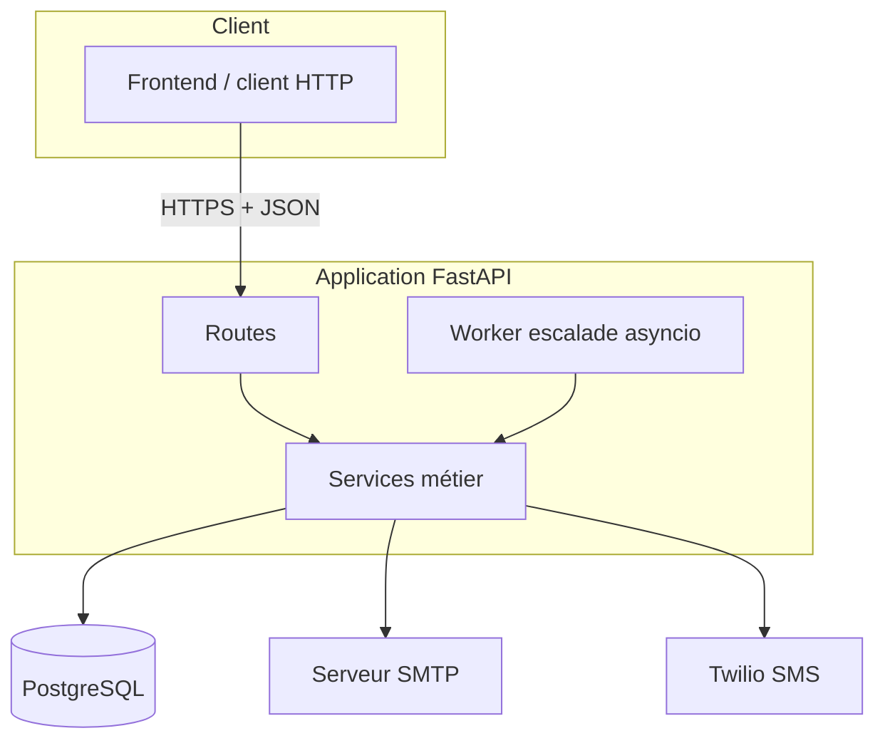
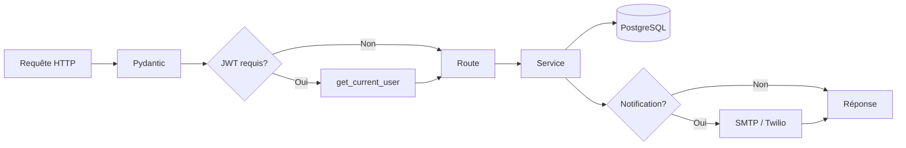
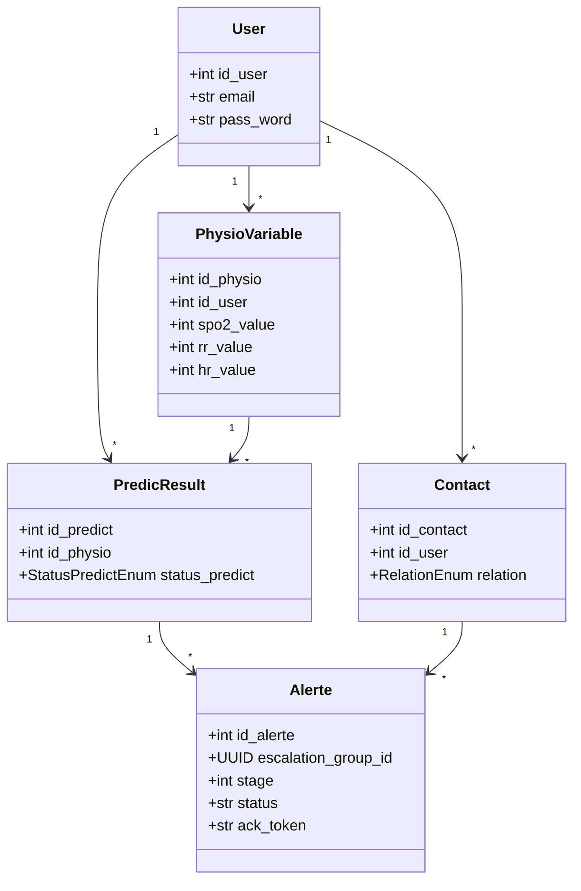
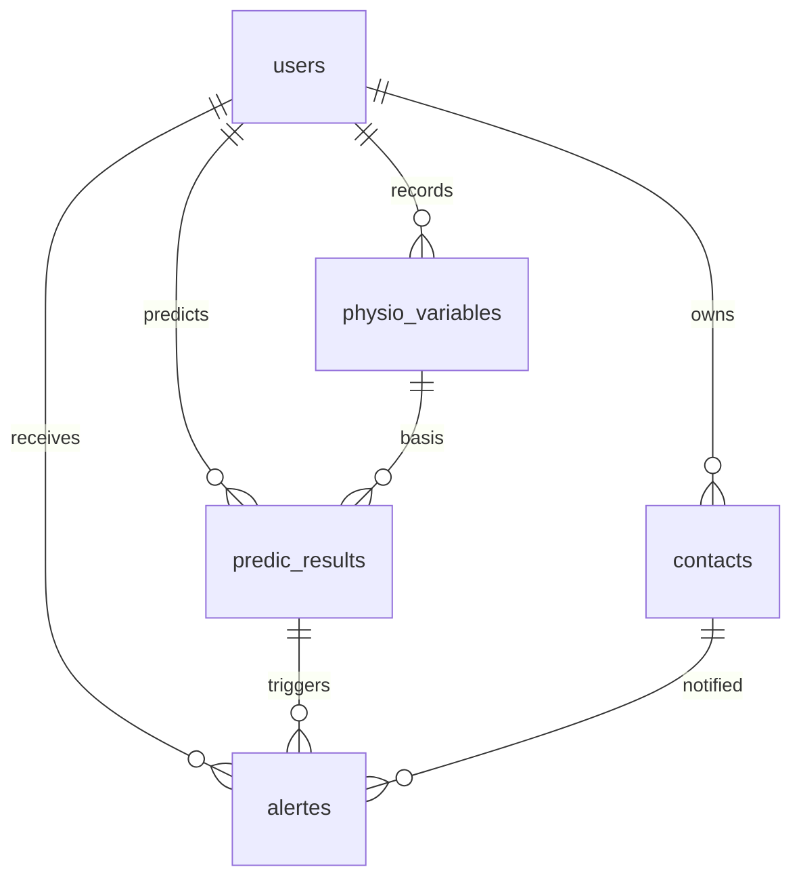
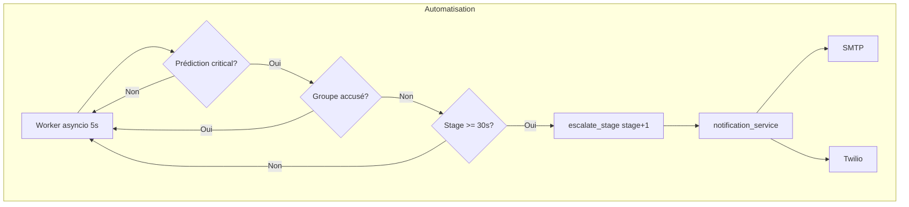
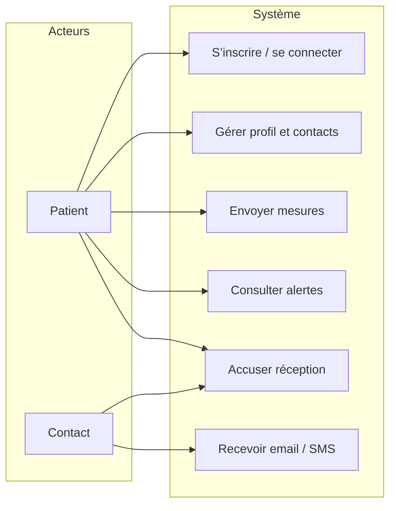
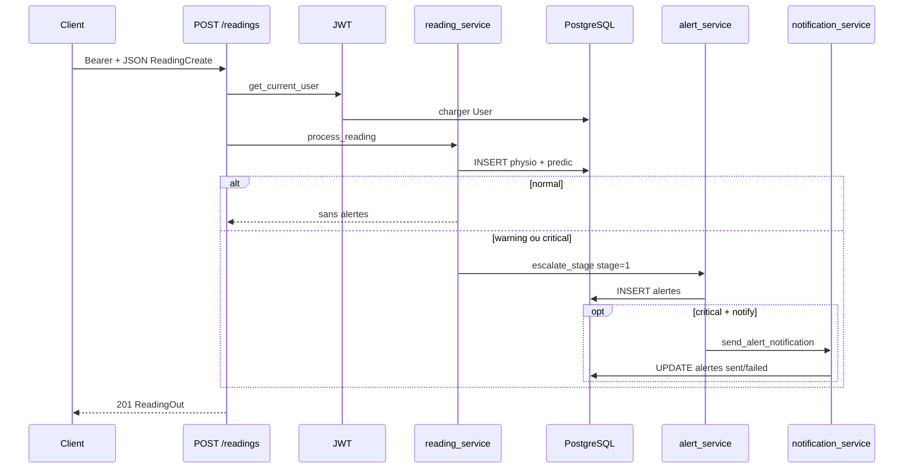

# Synthèse technique — Backend Ashtme

**API de suivi d’asthme** (mesures vitales, prédiction par règles, alertes et escalade).  
Document généré à partir de l’analyse du dépôt `backend/` (FastAPI, SQLAlchemy, PostgreSQL).

---

## Table des matières

1. [Vue d’ensemble du projet](#1-vue-densemble-du-projet)
2. [Architecture générale](#2-architecture-générale)
3. [Pipeline global](#3-pipeline-global)
4. [Technologies utilisées](#4-technologies-utilisées)
5. [Structure du projet](#5-structure-du-projet)
6. [APIs principales](#6-apis-principales)
7. [Base de données](#7-base-de-données)
8. [Authentification et sécurité](#8-authentification-et-sécurité)
9. [Automatisations et services externes](#9-automatisations-et-services-externes)
10. [Diagrammes UML](#10-diagrammes-uml)
11. [Flux de données](#11-flux-de-données)
12. [Déploiement](#12-déploiement)
13. [Points techniques importants](#13-points-techniques-importants)
14. [Résumé final du système](#résumé-final-du-système)

---

## 1. Vue d’ensemble du projet

| Aspect | Contenu |
|--------|---------|
| **Objectif du backend** | Exposer une API REST pour enregistrer des **mesures physiologiques** (SpO₂, fréquence respiratoire, fréquence cardiaque), les **classifier** en `normal` / `warning` / `critical`, persister des **prédictions**, créer des **alertes** vers des **contacts** classés par proximité, avec **escalade** temporelle et **notifications** (email prioritaire, SMS optionnel). |
| **Problème résolu** | Centraliser données patient, contacts d’urgence, décision de risque et traçabilité des envois / accusés, dans une base unique (typiquement **Supabase / PostgreSQL**). |
| **Fonctionnalités principales** | Inscription / connexion JWT, profil utilisateur, CRUD contacts, envoi de lectures avec pipeline métier, consultation alertes, accusé utilisateur et **lien public** pour accusé contact, escalade manuelle ou automatique. |
| **Logique générale** | **Monolithe modulaire** : HTTP → validation Pydantic → (JWT si route protégée) → **services** → SQLAlchemy → PostgreSQL ; notifications via **SMTP** ou **Twilio** ; boucle **asyncio** en tâche de fond pour l’escalade automatique. |
| **Utilisateurs** | **Patient** (compte API), **contacts** (notifiés, accusé par email sans compte), **équipe produit** (évolution future : ML, prod durcie). |

---

## 2. Architecture générale

Le système est un **monolithe FastAPI** : une application, plusieurs **routers** par domaine, logique métier dans **`app/services/`**, persistance dans **`app/db/`**. Aucun découpage microservices dans ce dépôt.

**Modules et responsabilités**

| Composant | Rôle |
|-----------|------|
| `main.py` (racine) | Point d’entrée Uvicorn : importe `app` depuis `app.main`. |
| `app/main.py` | Instancie FastAPI, enregistre les routers, **lifespan** : lance le worker d’escalade. |
| `app/routes/*` | Endpoints HTTP, dépendances `get_db` / `get_current_user`. |
| `app/services/*` | Lecture + prédiction, alertes / escalade, auth JWT, email, notifications, worker. |
| `app/db/database.py` | `DATABASE_URL`, engine, `SessionLocal`, `get_db`. |
| `app/db/models.py` | Modèles ORM alignés sur les tables PostgreSQL. |
| `app/schemas/*` | Contrats Pydantic entrée/sortie. |

**Interactions** : les routes appellent les services ; les services utilisent une `Session` SQLAlchemy et, si besoin, `email_service` / Twilio via `notification_service` ; le **worker** ouvre sa propre session et réutilise `escalate_stage`.

---

## 3. Pipeline global

**Chaîne type** : requête → routage FastAPI → **validation Pydantic** → **OAuth2 Bearer** (si dépendance `get_current_user`) → **contrôle d’accès** (`id_user` du token vs ressource) → **service** (transactions, règles) → **commit DB** → **appel externe** (email/SMS) si `notify` → **réponse JSON** (ou texte pour `ack-link`).

**Cas critique** `POST /readings` : enregistrement mesure → `classify_risk` → enregistrement `PredicResult` → si `normal`, fin ; si `warning`/`critical`, `escalate_stage` stage 1 ; **email seulement si `critical`** (`notify=True`). Le worker peut ensuite passer aux stages 2 et 3 pour les prédictions **critical** non accusées.

---

## 4. Technologies utilisées

| Technologie | Rôle | Où utilisée |
|-------------|------|-------------|
| **Python ≥ 3.13** | Runtime | `pyproject.toml` |
| **FastAPI** | Framework HTTP, OpenAPI | `app/main.py`, `app/routes/*` |
| **Uvicorn** | Serveur ASGI | `main.py`, lancement |
| **Pydantic v2** | Validation / sérialisation | `app/schemas/*` |
| **SQLAlchemy 2.x** | ORM, sessions | `app/db/*`, services, routes |
| **PostgreSQL** | Moteur SGBD relationnel (schéma, données métier) | Connexion via `DATABASE_URL` dans `database.py` |
| **Supabase** | **Cloud** : PostgreSQL managé (instance projet, pooler optionnel, sauvegardes, console SQL) | Même `DATABASE_URL` (URI fournie par le dashboard Supabase) ; scripts `supabase_*.sql` à la racine du backend ; description de l’API dans `app.main` (« Supabase Postgres ») |
| **psycopg2 / psycopg** | Drivers PostgreSQL | Dépendances projet |
| **python-jose** | JWT HS256 | `auth_service.py` |
| **passlib + bcrypt** | Hachage mot de passe | `auth_service.py`, schéma signup |
| **python-dotenv** | Variables d’environnement | `database.py` |
| **python-multipart** | Formulaire OAuth2 | `/auth/signin` (Swagger) |
| **smtplib** (stdlib) | Envoi email | `email_service.py` |
| **asyncio** | Tâche de fond escalade | `app/main.py` lifespan, `escalation_worker.py` |
| **requests** | Client HTTP | Déclaré dans `pyproject.toml` — **aucun import dans `app/`** au moment de l’analyse |
| **fastapi-mail** | Librairie email | Déclaré dans `pyproject.toml` — **non utilisé** (SMTP direct) |
| **Queue / broker** | Jobs asynchrones distribués | **Absent** — worker in-process uniquement |

---

## 5. Structure du projet

| Emplacement | Rôle |
|-------------|------|
| `main.py` | Entrée Uvicorn → `from app.main import app` |
| `app/main.py` | App FastAPI, routers, lifespan + worker |
| `app/db/` | Connexion + modèles SQLAlchemy |
| `app/routes/` | `auth`, `users`, `contacts`, `readings`, `alerts` |
| `app/services/` | Métier : `reading_service`, `alert_service`, `notification_service`, `email_service`, `auth_service`, `auth_dependencies`, `escalation_worker` |
| `app/schemas/` | DTOs Pydantic par domaine ; `prediction.py` définit `PredictionOut` (schéma disponible, routes dédiées prédictions non exposées dans les routers actuels) |
| `supabase_*.sql` | Scripts SQL optionnels (schéma / colonnes) |
| `test_db.py` | Utilitaire / test connexion (hors flux API principal) |

Organisation : **couches** routes → services → persistance ; pas de dossier `tests/` automatisé visible dans l’inventaire analysé.

---

## 6. APIs principales

Préfixes réels : `/auth`, `/users`, `/contacts`, `/readings`, `/alerts`. Préfixe API global type `/api/v1` : **non configuré** dans le code (racine `/`).

| Endpoint | Méthode | Description |
|----------|---------|-------------|
| `/` | GET | Santé : `{"status":"ok"}` |
| `/auth/signup` | POST | Création compte (hash bcrypt) |
| `/auth/signin` | POST | Login form OAuth2 (`username`=email) → JWT |
| `/auth/signin-json` | POST | Login JSON email + mot de passe → JWT |
| `/auth/logout` | POST | Message côté API (invalidation JWT côté client) |
| `/users/{id_user}` | GET / PUT | Profil ; JWT + `id_user` = token |
| `/contacts` | POST | Création contact (JWT + cohérence `id_user`) |
| `/contacts/{id_user}` | GET | Liste contacts (JWT) |
| `/contacts/{id_contact}` | PUT | Mise à jour contact — **sans JWT dans le code** |
| `/contacts/{id_contact}` | DELETE | Suppression — **sans JWT** |
| `/readings` | POST | Nouvelle lecture + pipeline prédiction / alertes (JWT) |
| `/readings/latest/{id_user}` | GET | Dernière mesure — **sans JWT** |
| `/readings/history/{id_user}` | GET | Historique — **sans JWT** |
| `/alerts/{id_user}` | GET | Liste alertes (JWT) |
| `/alerts/ack-link/{token}` | GET | Accusé contact (public, texte brut) |
| `/alerts/{id_alerte}/ack` | POST | Accusé patient, groupe d’escalade (JWT) |
| `/alerts/escalate/{id_predict}` | POST | Escalade manuelle (`stage` query, défaut 2) |

---

## 7. Base de données

**Entités** : `User` → `Contact`, `PhysioVariable`, `PredicResult`, `Alerte`. Une **lecture** génère un `PredicResult` ; les **alertes** lient une prédiction à un contact, avec `escalation_group_id` (UUID), `stage` (1–3 selon proximité), statut d’envoi et champs d’accusé.

**Relations** : `contacts.id_user` → `users` ; `physio_variables.id_user` → `users` ; `predic_results` lie `id_user` + `id_physio` ; `alertes` lie `id_user`, `id_predict`, `id_contact`. **Escalade** : stage 1 = contacts `very close`, 2 = `close`, 3 = `not that close` (enum Postgres aligné via `values_callable`).

---

## 8. Authentification et sécurité

| Mécanisme | Implémentation |
|-----------|----------------|
| **JWT** | `create_access_token` / `decode_token` ; payload `sub` = `id_user` ; `JWT_SECRET`, `JWT_ALGORITHM`, `JWT_EXPIRES_MINUTES` |
| **OAuth2** | `OAuth2PasswordBearer(tokenUrl="/auth/signin")` pour extraction du header `Authorization: Bearer` |
| **Sessions serveur** | **Non** — API stateless (JWT uniquement) |
| **Mots de passe** | bcrypt via passlib ; limite 72 caractères côté schéma |
| **Validation** | Pydantic sur les corps de requête |
| **Permissions** | Contrôle explicite `current_user.id_user` vs ressource sur la majorité des routes protégées |
| **Écarts** | `GET /readings/*`, `PUT`/`DELETE /contacts/{id_contact}` sans `get_current_user` — surface d’exposition à traiter en durcissement prod |

---

## 9. Automatisations et services externes

| Élément | Comportement |
|---------|----------------|
| **Worker** | `run_escalation_loop` : toutes les **5 s**, pour prédictions **critical** avec alertes non accusées, si le stage courant dure **≥ 30 s**, appelle `escalate_stage` pour le stage suivant (`notify=True`). |
| **Email** | SMTP (`SMTP_HOST`, `SMTP_PORT`, `SMTP_USER`, `SMTP_PASS`, `SMTP_FROM`, `SMTP_TLS`) ; corps d’email enrichi d’un lien si `PUBLIC_BASE_URL` défini : `{base}/alerts/ack-link/{ack_token}`. |
| **SMS** | Twilio si pas d’`email_contact` et variables Twilio présentes, et `NOTIF_DRY_RUN` faux. |
| **Dry run** | `NOTIF_DRY_RUN` (ou `SMS_DRY_RUN`) : pas d’envoi réel, identifiant factice. |
| **WhatsApp / Google / n8n / webhooks** | **Non implémentés** dans le code analysé. |

---

## 10. Diagrammes UML

### Cas d’utilisation (synthèse)

### Séquence — enregistrement d’une lecture (vue simplifiée)

Les diagrammes **architecture** et **workflow pipeline** sont repris aux [§2](#2-architecture-générale) et [§3](#3-pipeline-global).

---

## 11. Flux de données

1. **Frontend → backend** : JSON sur HTTPS ; token JWT dans `Authorization` pour les routes protégées ; formulaire pour `/auth/signin` (Swagger).
2. **Backend → DB** : SQLAlchemy ORM (`Session` par requête via `get_db`, session dédiée dans le worker).
3. **Backend → externes** : SMTP (TLS), API Twilio REST pour SMS ; pas d’autre API HTTP métier dans `app/services/`.
4. **Retour utilisateur** : JSON Pydantic (`response_model`) ou texte pour `ack-link` ; codes HTTP standards (401, 403, 404, 409, etc.).

---

## 12. Déploiement

| Sujet | État dans le dépôt |
|-------|---------------------|
| **Docker / Compose** | **Absent** — déploiement manuel ou à ajouter |
| **Variables d’environnement** | `DATABASE_URL`, `JWT_*`, `SMTP_*`, `PUBLIC_BASE_URL`, `NOTIF_DRY_RUN`, `TWILIO_*` |
| **Lancement** | `uvicorn main:app --reload` (depuis la racine `backend/`) |
| **Architecture cible** | Process unique API + worker asyncio **dans le même process** — en multi-instances, prévoir verrouillage ou file de jobs |

---

## 13. Points techniques importants

| Catégorie | Détail |
|-----------|--------|
| **Bonnes pratiques** | Séparation routes / services ; schémas Pydantic ; hachage bcrypt ; JWT ; duplication contrôlée login form + JSON. |
| **Optimisations possibles** | Transaction unique sur `process_reading` ; index SQL sur dates et `(id_predict, stage)` ; pagination historique. |
| **Difficultés / risques** | Enum Postgres `relation` vs Python ; alignement schéma SQL (`alertes.*`) avec ORM ; worker silencieux sur exception (`except: pass`) ; routes sans JWT. |
| **Forces** | Pipeline métier lisible ; escalade par stages et groupe UUID ; notifications traçables (`status`, `error_message`, timestamps). |

---

## Résumé final du système

Le backend **Ashtme** est une **application FastAPI monolithique** qui sert de **couche d’orchestration** entre un client (web ou mobile), une base **PostgreSQL** (typiquement **hébergée sur Supabase** en cloud) et des **canaux de notification** (email SMTP, SMS Twilio en secours). Le cœur métier réside dans **`process_reading`** : chaque mesure est persistée, classifiée par **règles simples** (pas de modèle ML dans le code actuel), puis une ligne **`PredicResult`** est créée. Si le statut n’est pas `normal`, le système crée des **alertes de premier palier** pour les contacts « très proches » ; les **emails** ne partent que pour les cas **critical**, conformément à la logique actuelle. Les alertes partagent un **`escalation_group_id`** et un **`ack_token`** pour permettre à un contact d’**accuser réception sans compte**, tandis que le patient peut accuser via une route authentifiée, ce qui **fige tout le groupe** et stoppe l’escalade automatique.

L’**architecture** repose sur des **routers** REST par domaine et des **services** réutilisables (`alert_service`, `notification_service`, `auth_service`). Un **worker asyncio** lancé au **démarrage de l’application** interroge périodiquement la base pour les prédictions **critical** encore en escalade et déclenche les **stages 2 et 3** après un délai, en réutilisant la même fonction `escalate_stage` que l’escalade manuelle. Les **technologies** principales sont **FastAPI**, **SQLAlchemy**, **Pydantic**, **JWT**, **bcrypt**, **PostgreSQL** sur **Supabase** (cloud) ; les dépendances **Docker**, **queue**, **n8n** ou **WhatsApp** ne font pas partie du code livré ici. En résumé, c’est un **prototype structuré et pédagogique**, prêt à être présenté comme une **API de santé connectée** avec traçabilité des alertes, tout en nécessitant un **durcissement sécurité** (routes sensibles, observabilité du worker, infra de déploiement) pour un usage production réel.
